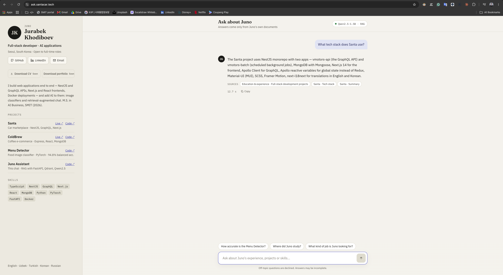
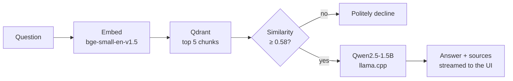

<div align="center">

# Juno Assistant

**An AI assistant that answers recruiters' questions about my background, skills and projects.**

Retrieval-augmented generation with a small open-source LLM — running on a 2-core CPU server, with no paid AI API.

### [▶ Try it live: ask.santacar.tech](https://ask.santacar.tech)




</div>

## Highlights

- **Grounded answers** — the assistant answers only from my own documents, shows the sources of every answer and declines what it doesn't know.
- **Measured, not guessed** — every design decision was checked on small test sets: retrieval Hit@5 went from **81% to 100%**, and the language model was chosen by comparing three models on answer quality and invented facts.
- **Cheap to run** — a 4-bit quantized Qwen2.5-1.5B (1.2 GB) runs on the CPU of an existing VPS, next to two other apps. Total extra cost: **$0**.
- **Real product details** — streamed answers, follow-up questions ("tell me more about that"), off-topic guardrail, rate limiting and HTTPS.

## How it works



1. **Knowledge base** — Markdown files in `knowledge/` (about, skills, education, one file per project), split into chunks by their headings.
2. **Embeddings** — every chunk gets a context header (person · document · section) and is embedded with `BAAI/bge-small-en-v1.5`, then stored in Qdrant.
3. **Retrieval** — the question is embedded with a query instruction and the five most similar chunks are returned.
4. **Guardrail** — chunks below a calibrated similarity threshold are dropped. If none remain, the model is not called at all.
5. **Generation** — Qwen2.5-1.5B-Instruct answers from the chunks only (system prompt + one example). Answers stream to the browser as NDJSON.
6. **Follow-ups** — a question that refers back ("that project", "in detail") is searched together with the previous question.

## Evaluation

All test scripts are in `scripts/` and every run is saved in `eval_results/`.

### Retrieval — is the correct passage in the top results? (16 questions)

| Setup | Hit@1 | Hit@5 |
|---|:---:|:---:|
| all-MiniLM-L6-v2 (baseline) | 62% | 81% |
| bge-small-en-v1.5 | 62% | 88% |
| **bge-small + context header on every chunk** | **81%** | **100%** |

### Answers — required facts present, nothing invented (11 questions + 2 off-topic)

| Model | Passed | Grounded | Off-topic declined | Size |
|---|:---:|:---:|:---:|:---:|
| TinyLlama-1.1B-Chat | 5/11 | 6/11 | 2/2 | 2.2 GB |
| Qwen2.5-0.5B-Instruct | 9/11 | 11/11 | 2/2 | 1.0 GB |
| Qwen2.5-1.5B-Instruct | 11/11 | 11/11 | 2/2 | 3.1 GB |
| **Qwen2.5-1.5B-Instruct, 4-bit GGUF (deployed)** | **10/11** | **11/11** | **2/2** | **1.2 GB** |

*Grounded* means the answer contains no numbers, links or accounts that are missing from the retrieved passages. The original plan used TinyLlama; this check showed it invented facts in almost half of its answers, so the project switched to Qwen2.5.

### Guardrail

The similarity threshold was calibrated on relevant vs. off-topic questions (`scripts/calibrate_threshold.py`): the lowest relevant score was 0.622 and the highest off-topic score 0.544, so the threshold sits between them at 0.58.

## Deployment

```
Browser ──HTTPS──► Nginx (ask.santacar.tech, Let's Encrypt, rate limit)
                     ├── /      ──► juno-web     Next.js standalone   127.0.0.1:3100
                     └── /api/  ──► juno-api     FastAPI + llama.cpp  127.0.0.1:8000
                                        └──► juno-qdrant (internal network only)
```

- **Server:** Ubuntu VPS with 2 vCPU and 8 GB RAM, shared with two other projects.
- **Containers:** `docker-compose.prod.yml` — CPU-only PyTorch, llama.cpp for the quantized model, models cached in a Docker volume.
- **Security:** app ports listen on localhost only, Nginx limits each IP to 10 requests per minute, HTTPS certificate renews automatically.
- **Latency:** 5–13 s for a full answer on the 2-core CPU; the first words appear sooner thanks to streaming.

## Tech stack

| Layer | Technologies |
|---|---|
| Backend | Python, FastAPI, Pydantic, Qdrant, sentence-transformers, llama.cpp, Hugging Face Transformers, PyTorch |
| Frontend | Next.js (App Router), React, TypeScript, CSS Modules |
| Infrastructure | Docker Compose, Nginx, Let's Encrypt |

## Project structure

```
app/                     FastAPI backend
  api/                   /health, /chat, /chat/stream
  services/              chunker, embeddings, vector store, LLM (transformers | llama.cpp), RAG
  schemas/               request and response models
knowledge/               the assistant's knowledge base (Markdown)
scripts/                 ingest, search, evaluation and threshold calibration
eval_results/            saved evaluation runs
web/                     Next.js chat interface
docker-compose.yml       Qdrant for local development
docker-compose.prod.yml  production stack (Qdrant + API + web)
```

## Run locally

Requirements: Python 3.12, Node.js 20+, Docker.

```bash
# 1. Vector database
docker compose up -d

# 2. Backend
python3.12 -m venv .venv && source .venv/bin/activate
pip install -r requirements.txt
cp .env.example .env
python -m scripts.ingest                          # chunk, embed and store the knowledge base
uvicorn app.main:app --reload --reload-dir app    # http://localhost:8000/docs

# 3. Frontend
cd web
cp .env.example .env.local
npm install
npm run dev                                       # http://localhost:3100
```

Run the evaluations:

```bash
python -m scripts.eval_retrieval
python -m scripts.eval_answers
LLM_BACKEND=llama_cpp python -m scripts.eval_answers   # quantized model on CPU
```

## Roadmap

- LoRA fine-tuning of Qwen2.5-0.5B to reach 1.5B quality with a smaller model
- Larger evaluation set with LLM-as-a-judge scoring

## Author

**Jurabek (Juno) Khodiboev** — full-stack developer in Seoul
[LinkedIn](https://www.linkedin.com/in/jurabek-khodiboev-4bab4427b) · [GitHub](https://github.com/khodiboev) · fikrchi@gmail.com
